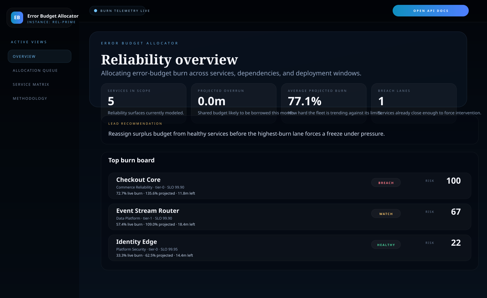
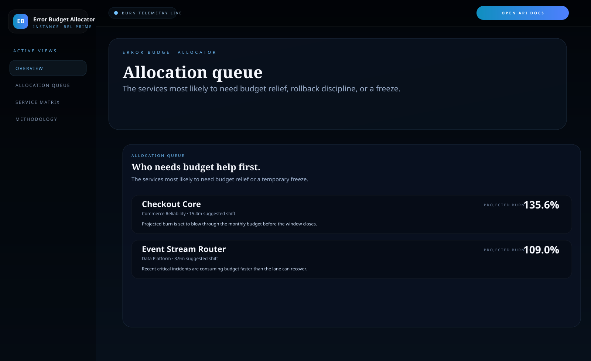
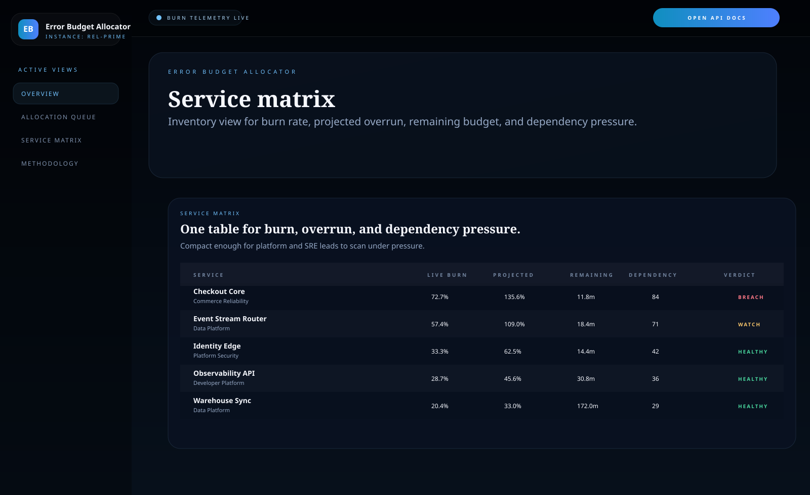
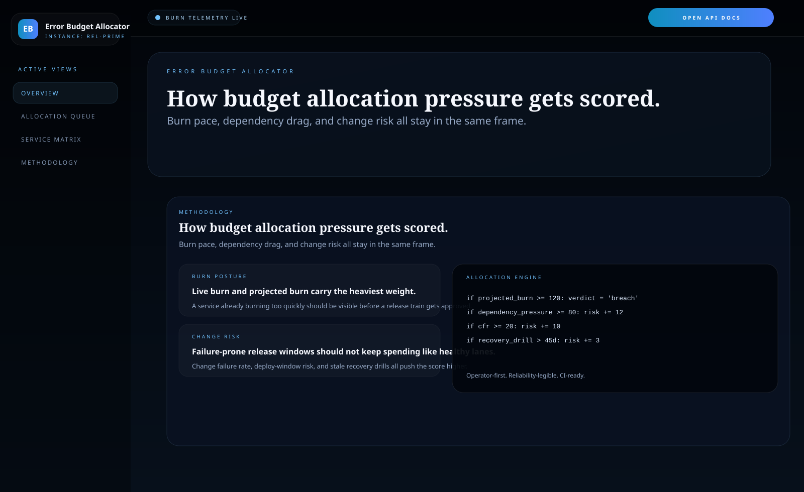

# Error Budget Allocator

Python and FastAPI control surface for **allocating error-budget burn across services, dependencies, deployment windows, and ownership lanes**.

> **What this repo proves**
>
> Reliability leadership is not just about knowing a service is hot. It is about deciding which lane should slow down, which team can lend margin, and where a freeze becomes the responsible move.

## Why this repo exists

Error budgets are easy to talk about and harder to operate. Teams usually know their SLO targets, but once burn starts rising, the operational questions get messy fast:

- which service is actually putting the month-end budget at risk
- which healthy lane can donate headroom before a freeze is necessary
- how much dependency pressure should count against a service that looks stable in isolation
- whether the right answer is to keep shipping, tighten rollout gates, or pause changes entirely

`error-budget-allocator` models that arbitration layer directly. It turns raw budget burn, forecasted overrun, incident pressure, deployment risk, and dependency drag into an operator-facing allocation queue.

## Screenshots






## What it includes

- FastAPI service with HTML proof surfaces and JSON APIs
- sample reliability fleet with tiered services, budget consumption, incident counts, and deployment risk
- allocation queue for `watch` and `breach` lanes
- service matrix for burn, projected overrun, dependency pressure, and ownership
- methodology view for how the allocator scores burn pressure
- SVG proof assets generated from the same service state
- unit tests, smoke checks, and GitHub Actions CI

## Local run

```powershell
cd error-budget-allocator
py -3.11 -m venv .venv
.\.venv\Scripts\pip.exe install -r requirements.txt
.\.venv\Scripts\python.exe -m app.main
```

Open:

- [http://127.0.0.1:4948/](http://127.0.0.1:4948/)
- [http://127.0.0.1:4948/allocations](http://127.0.0.1:4948/allocations)
- [http://127.0.0.1:4948/service-matrix](http://127.0.0.1:4948/service-matrix)
- [http://127.0.0.1:4948/methodology](http://127.0.0.1:4948/methodology)
- [http://127.0.0.1:4948/docs](http://127.0.0.1:4948/docs)

If the port is busy:

```powershell
$env:PORT = "4952"
.\.venv\Scripts\python.exe -m app.main
```

## Validation

```powershell
.\.venv\Scripts\python.exe -m unittest discover -s tests
.\.venv\Scripts\python.exe scripts\run_demo.py
.\.venv\Scripts\python.exe scripts\smoke_check.py
.\.venv\Scripts\python.exe scripts\render_readme_assets.py
```

## API routes

- `GET /api/dashboard/summary`
- `GET /api/services`
- `GET /api/services/{service_id}`
- `GET /api/allocations`
- `GET /api/owners`
- `GET /api/burn-matrix`
- `GET /api/sample`

## Repo layout

```text
app/
  data/
  services/
docs/
scripts/
screenshots/
tests/
```
